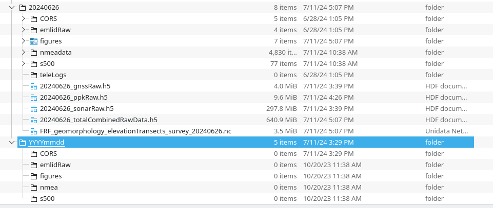

# SWACSS
This codebase is focused on the operational workflow development for the SWACSS project. This is starting with the yellowfin ASV. 
`workflow_ppk.py` will process raw observation/navigation data from the yellowfin, with CORS or other RINEX base station files 
into netCDF using post processing kinematic (PPK) positioning. 

## How to run yellowfin workflow: 
`python workflow_ppk.py [args]`

with example argument 

`python workflow_ppk.py -d /data/yellowfin/20240626`
### available arguments
``` 
'-d', '--data_dir'     -REQUIRED: the data directory to process
'-g', '--geoid_file'   -the location of the geoid file that is used during processing (default='ref/g2012bu0.bin')
'-p', '--make_pos'     -boolean to instruct code to make a pos file or if one is provided from external processed script (default=True)
                        if True, the rtklib libary needs to be installed 

'--rtklib_executable'  -the location of the rtklib exectuable (default=ref/rnx2rtkp)
'--sonar_method'       -the method used for picking the bottom from backscatter and time syncing (default='instant')
                        'instant' uses the native s500 algorithm w/o a filter
                        'smoothed' uses the native s500 algorithm w/ native kalman filter

"--ppk_quality_threshold"     - this is a quality threshold 1: Fixed, 2: Float, 4:DGPS, 5: single -- see appendix B for 
                                more details: https://rtkexplorer.com/pdfs/manual_demo5.pdf 
"--instant_sonar_confidence"  - This is a filter threshold for instantaneous confidence for each sonar ping
"--smoothed_sonar_confidence" - This is a filter threshold for smoothed confidence from the sonar
```
### Assumptions:
The code expects a `data_dir` argument passed which should be a folder in the `YYYYMMDD` format
the code expects the following folders [`CORS`, `emlidRaw`, `nmeadata`, `s500`]. 
It will make `figures` folder.  It's good practice to save the tele operation files in the `teleLogs` folder, but this script does not use those files (yet). 

The below image shows an example of processed folder and what it looks like at the top, with a generic folder with required subfolders below


each folder is expected to have files within it, specifically:

__CORS__ - this folder is expected to have a zip file with PPK observations from a CORS station (including `.*sp3` if available).
If observation and navigation files are manually generated, the script will look for `.*o` and `.*n` files in this directory


__emlidRaw__ - this folder is expected to have `*RINEX*.zip` files containing (`*o` - observation files) (multiple ok) 

      
__nmeadata__ - this folder is expected to have `.dat` files (text) in them with nmea data fom the GNSS. this file is mainly used 
for logging the system clock (time stamp for sonar) and the GNSS time.  The `.dat` files can be in a folder with date 
convention of `MM-dd-YYYY` though this is checked against the root data directory to ensure the dates are the same   


__s500__ - this folder is expected to have `*.dat` files (binary) in them with sonar data.  The `.dat` files can be in a folder with date 
convention of `MM-dd-YYYY` though this is checked against the root data directory to ensure the dates are the same


# WARNING!!!!!
Sometime around 7/10 we changed Pi computer clock was changed from ET to UTC.  We should be able to compare system clock time to Nick's Field notes for start log to confirm if 8/16 survey was in ET or UTC. It's important to note that there is a hard/stupid fix of data prior to that to UTC.


